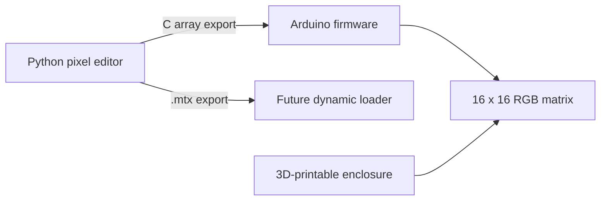

# Arduino NeoPixel Matrix

A complete 16 × 16 RGB LED matrix project combining embedded firmware, a custom desktop pixel-art editor, and a 3D-printable enclosure.

The project currently displays a static image on an Arduino Uno-controlled NeoPixel matrix. The repository also contains a Python/Tkinter editor that can generate Arduino-compatible color data and a custom `.mtx` representation for future dynamic image loading.

## Project overview



This project brings together several engineering areas:

- embedded firmware development on Arduino Uno;
- coordinate transformation for a serpentine-wired LED matrix;
- a Python desktop tool for creating pixel art;
- custom image-data export;
- mechanical design for a printable enclosure and supporting parts.

## Current features

### Arduino firmware

- Controls a 16 × 16, 256-pixel RGB NeoPixel matrix.
- Maps two-dimensional image coordinates to the physical serpentine LED layout.
- Corrects the vertical orientation of the installed matrix.
- Displays a compiled-in static image.
- Uses the Adafruit NeoPixel library.

### Pixel-art editor

The included `NeoPixel_Matrix_Canvas.py` application provides:

- a 16 × 16 drawing canvas;
- color selection;
- continuous mouse drawing;
- an eraser and canvas reset function;
- global brightness scaling before export;
- export as Arduino C array rows;
- export to the custom `.mtx` text format.

### Mechanical design

The `NeoPixel_Matrix_frame` directory contains STL files for:

- the upper frame and pixel-separating grid;
- the lower enclosure with hardware cut-outs;
- desktop support feet;
- an LED-position alignment template.

The enclosure is an early hardware revision and may require small adjustments depending on the exact matrix PCB and connector placement.

## Repository structure

```text
ArduinoNeoPixelMatrix/
├── NeoPixel_Array/
│   └── NeoPixel_Array.ino
├── NeoPixel_Matrix_Canvas.py
├── NeoPixel_Matrix_frame/
│   ├── Feet.stl
│   ├── LED_positions.stl
│   ├── NeoPixel_Matrix_frame_bottom_frame.stl
│   └── NeoPixel_Matrix_frame_top_frame_with_grid.stl
└── README.md
```

## Requirements

### Firmware

- Arduino Uno or compatible board
- 16 × 16 WS2812/NeoPixel-compatible RGB matrix
- Arduino IDE
- [Adafruit NeoPixel library](https://github.com/adafruit/Adafruit_NeoPixel)
- A suitable external 5 V power supply for the LED matrix

> **Power note:** A 256-pixel RGB matrix can require substantially more current than an Arduino board can safely provide. Power the matrix from a properly rated external supply and connect the supply ground to the Arduino ground.

### Pixel editor

- Python 3
- Tkinter, normally included with standard Python desktop installations

No third-party Python packages are currently required.

## Using the current version

### 1. Create an image

Run the editor from the repository root:

```bash
python NeoPixel_Matrix_Canvas.py
```

Draw the image, select the required brightness, and choose **Export to TXT**.

### 2. Add the exported image to the firmware

The generated `export.txt` file contains the rows of an Arduino-compatible color matrix. Replace the contents of the `colorMatrix` initializer in:

```text
NeoPixel_Array/NeoPixel_Array.ino
```

with the exported rows.

### 3. Upload the firmware

Open the sketch in Arduino IDE, install the Adafruit NeoPixel library if required, select the correct board and serial port, and upload the firmware.

The included example image is a hand-drawn Mount Fuji scene with a Japanese pagoda.

## Implementation details

The physical LEDs are arranged in alternating directions. The firmware converts logical `(x, y)` coordinates to the correct physical LED index:

```cpp
int getPixelIndex(int x, int y) {
  int invertedY = 15 - y;

  if (invertedY % 2 == 0) {
    return invertedY * 16 + x;
  }

  return invertedY * 16 + (15 - x);
}
```

This allows the image data to remain stored as a conventional two-dimensional array while the mapping function handles the physical wiring layout.

## Project status and limitations

This repository currently represents a working prototype rather than a finished product.

- The Arduino firmware displays one image compiled into the sketch.
- The `.mtx` format can be exported by the editor but is not yet loaded by the firmware.
- The editor does not yet reopen existing `.mtx` files.
- Matrix dimensions and hardware pins are currently fixed in the source code.
- The static image representation is memory-intensive for an Arduino Uno.
- The enclosure is a first mechanical revision.

## Planned improvements

- Store image data more efficiently, for example in flash memory.
- Separate generated image data from the main firmware source.
- Add `.mtx` import to the desktop editor.
- Implement dynamic image loading on an ESP32-based version.
- Add SD-card or serial image transfer.
- Make matrix dimensions, orientation, and pin assignment configurable.
- Add hardware photos, a wiring diagram, and a short demonstration video.
- Add automated checks for the Python exporter and coordinate mapping.

## Background

This is a personal end-to-end embedded project covering firmware, tooling, physical integration, and mechanical prototyping. Its main purpose is to explore how a small embedded product can be supported by purpose-built development tools instead of treating the firmware as an isolated sketch.
