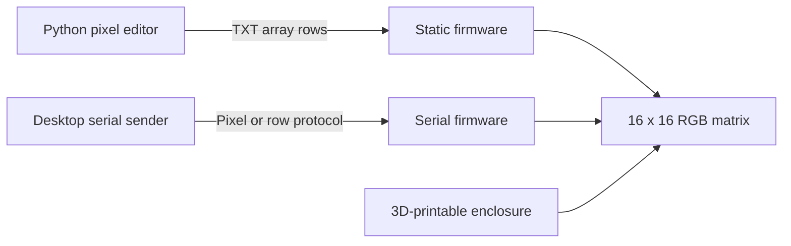

# Arduino NeoPixel Matrix

A complete 16 × 16 RGB LED matrix project combining embedded firmware, serial image transfer, a custom desktop pixel-art editor, reusable static pictures, and a 3D-printable enclosure.

The project supports a compiled-in static image and two serial receiver variants for an Arduino Uno-controlled NeoPixel matrix. The repository also contains a Python/Tkinter editor, a curated set of Arduino-ready image snippets, hardware test sketches, and enclosure models.

## Project overview



This project brings together several engineering areas:

- embedded firmware development on Arduino Uno;
- coordinate transformation for a serpentine-wired LED matrix;
- a Python desktop tool for creating pixel art;
- static and serial image transfer workflows;
- custom image-data export and reusable picture sources;
- mechanical design for a printable enclosure and supporting parts.

## Current features

### Arduino firmware

- Controls a 16 × 16, 256-pixel RGB NeoPixel matrix.
- Maps two-dimensional image coordinates to the physical serpentine LED layout.
- Corrects the vertical orientation of the installed matrix.
- Displays a compiled-in static image, currently Mount Fuji and a pagoda.
- Includes a legacy receiver that accepts one `RRGGBB` pixel per serial line.
- Includes an optimized receiver that accepts one 16-pixel row per serial line.
- Includes full-matrix color and individual-pixel diagnostic sketches.
- Uses the Adafruit NeoPixel library.

### Pixel-art editor

The included `tools/pixel_editor/NeoPixel_Matrix_Canvas.py` application provides:

- a 16 × 16 drawing canvas;
- color selection;
- continuous mouse drawing;
- an eraser and canvas reset function;
- global brightness scaling before export;
- export as Arduino C array rows;
- export to the custom `.mtx` text format.

### Mechanical design

The `hardware/enclosure` directory contains STL files for:

- the upper frame and pixel-separating grid;
- the lower enclosure with hardware cut-outs;
- desktop support feet;
- an LED-position alignment template.

The enclosure is an early hardware revision and may require small adjustments depending on the exact matrix PCB and connector placement.

### Static picture gallery

`assets/patterns/txt` contains six 16 × 16 pictures as Arduino initializer rows. Keeping these generated `.txt` snippets makes it possible to replace the static `colorMatrix` without changing the exporter or introducing a build-time conversion step. See [Static image source files](docs/static-images.md).

## Repository structure

```text
ArduinoNeoPixelMatrix/
├── assets/patterns/txt/       # Arduino-ready 16 x 16 image snippets
├── docs/                      # Serial protocol and static image guides
├── examples/                  # Matrix hardware diagnostic sketches
├── firmware/
│   ├── serial/                # Legacy and optimized serial receivers
│   └── static_image/          # Compiled-in image firmware
├── hardware/enclosure/        # 3D-printable STL files
├── tools/pixel_editor/        # Python/Tkinter image editor
├── .gitignore
└── README.md
```

## Requirements

### Firmware

- Arduino Uno or compatible board
- 16 × 16 WS2812/NeoPixel-compatible RGB matrix
- Arduino IDE
- [Adafruit NeoPixel library](https://github.com/adafruit/Adafruit_NeoPixel)
- A suitable external 5 V power supply for the LED matrix

> **Power note:** A 256-pixel RGB matrix can require substantially more current than an Arduino board can safely provide. Power the matrix from a properly rated external supply and connect the supply ground to the Arduino ground.

### Pixel editor

- Python 3
- Tkinter, normally included with standard Python desktop installations

No third-party Python packages are currently required.

## Usage

### Static image workflow

Run the editor from the repository root:

```bash
python tools/pixel_editor/NeoPixel_Matrix_Canvas.py
```

Draw the image, select the required brightness, and choose **Export to TXT**.

The generated `export.txt` file contains the rows of an Arduino-compatible color matrix. Replace the contents of the `colorMatrix` initializer in:

```text
firmware/static_image/NeoPixel_Array/NeoPixel_Array.ino
```

with the exported rows. Existing ready-to-copy pictures are available in `assets/patterns/txt`; their exact format and names are described in [Static image source files](docs/static-images.md).

Open the sketch in Arduino IDE, install the Adafruit NeoPixel library if required, select the correct board and serial port, and upload the firmware.

The included example image is a hand-drawn Mount Fuji scene with a Japanese pagoda.

### Serial image workflow

Choose one of the following sketches:

- `firmware/serial/NeoPixel_Serial/NeoPixel_Serial.ino` receives and displays one pixel per line;
- `firmware/serial/NeoPixel_Serial_optimised/NeoPixel_Serial_optimised.ino` receives and displays one complete 16-pixel row per line.

The two sketches use different wire protocols. Read [Serial firmware and protocol](docs/serial-protocol.md) before implementing or selecting a sender. The optimized version is recommended for normal frame transfer; the legacy version remains available for compatibility and debugging.

### Hardware diagnostics

- `examples/NeoPixel_AllRGB_test/NeoPixel_AllRGB_test.ino` fills the complete matrix with red, green, blue and a pale white test color.
- `examples/NeoPixel_IndividualRGB_test/NeoPixel_IndividualRGB_test.ino` walks through every logical position one at a time in each RGB channel, making wiring-order and mapping errors easier to locate.

## Implementation details

The physical LEDs are arranged in alternating directions. The firmware converts logical `(x, y)` coordinates to the correct physical LED index:

```cpp
int getPixelIndex(int x, int y) {
  int invertedY = 15 - y;

  if (invertedY % 2 == 0) {
    return invertedY * 16 + x;
  }

  return invertedY * 16 + (15 - x);
}
```

This allows the image data to remain stored as a conventional two-dimensional array while the mapping function handles the physical wiring layout.

## Project status and limitations

This repository currently represents a working prototype rather than a finished product.

- The static Arduino firmware displays one image compiled into the sketch.
- Two serial receivers provide pixel-by-pixel and row-by-row image transfer.
- Serial transfer has no acknowledgement, checksum or atomic frame swap.
- The `.mtx` format can be exported by the editor but is not yet loaded by the firmware.
- The editor does not yet reopen existing `.mtx` files.
- Matrix dimensions and hardware pins are currently fixed in the source code.
- The static image representation is memory-intensive for an Arduino Uno.
- The enclosure is a first mechanical revision.

## Planned improvements

- Store image data more efficiently, for example in flash memory.
- Add an automated converter from the maintained TXT snippets to firmware headers.
- Add `.mtx` import to the desktop editor.
- Implement dynamic image loading on an ESP32-based version.
- Add framing, checksums and acknowledgements to serial image transfer.
- Add SD-card image loading.
- Make matrix dimensions, orientation, and pin assignment configurable.
- Add hardware photos, a wiring diagram, and a short demonstration video.
- Add automated checks for the Python exporter, picture dimensions, serial parser and coordinate mapping.

## Background

This is a personal end-to-end embedded project covering firmware, tooling, physical integration, and mechanical prototyping. Its main purpose is to explore how a small embedded product can be supported by purpose-built development tools instead of treating the firmware as an isolated sketch.
